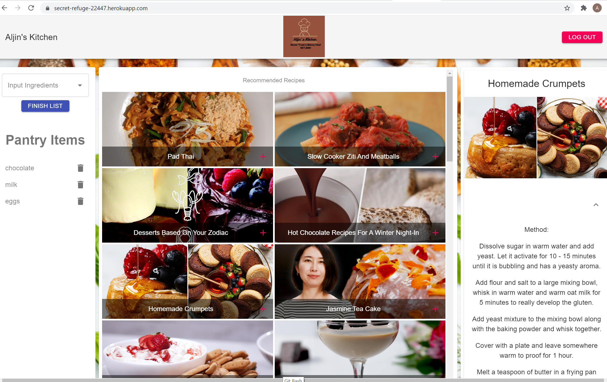

# Aljin's Kitchen

## Description

This is a MERN stack application that follows the MVC design pattern. The program utilizes Auth0 user authentication method to register users. The application is designed to search recipes based on the ingredients provided by the user from a third party API. 

## Table of Contents

* [Installation](#installation)
* [Usage](#usage)
* [contributing](#credits)
* [Issues](#issues)
* [Questions](#questions)

## Installation
The program uses React.js, React Router, Axios and  Material-UI for the front end. MongoDB and Node to query and route data in the app. Express for Tasty’s Rest API to query and manage data.

## Usage 
To run this application locally, run `npm i` to Install node dependencies, verify database connection information, start MongoDB instance:mongodb. Run `npm run start` on your terminal to start the server and follow the link or open it on your browser to view the application on your computer(locally). The application running on Heroku can be found [Here]( https://secret-refuge-22447.herokuapp.com/)

## Contribution

When contributing to this repository, please first discuss the change you wish to make via issue, email, or any other method with the owners of this repository before making a change.

## Issues

Feel free to submit issues and enhancement requests.

## Questions?
For any questions you may have, feel free to contact us via the information provided below:

[Github Page]

* [jinchoo]( https://github.com/jinchoo)
* [LisaAAAlisa]( https://github.com/LisaAAAlisa)
* [JoseSachango]( https://github.com/JoseSachango)
* [HananYusuf](https://github.com/HananYusuf/)

